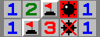

# swiiper

*A homebrew minesweeper game for the Wii*

## Installation

Download the .zip file from the [Releases](https://github.com/myswang/releases) page, extract and copy the files to the root of your SD card. You can also get the standalone .dol file and load it with Dolphin, if you *really* want to (a real Wii is recommended)

### Building from source

You will need to install the **devkitPro** toolchain for the Wii, along with the **GRRLIB** library. Instructions for setting these up vary depending on your system, so it's probably best to look at the setup instructions for both. I personally recommend starting with a basic "Hello World" C application to verify that your setup is working, before trying to build this application.

- [devkitPro Getting Started guide](https://devkitpro.org/wiki/Getting_Started)
- [GRRLIB](https://github.com/GRRLIB/GRRLIB)

Once you are all setup, run `make` to build the project, and it should produce a `swiiper.dol` file.

***NOTE:** In order to allow saving a custom difficulty configuration, the game will look for a `config.ini` file on the SD card, stored at `sd:/apps/swiiper/config.ini`. The app might crash or fail to load if this file + directory structure doesn't exist. Please make sure this file exists before running the game!*

## Controls

### Wii remote (nunchuk)

**D-pad (+ analog stick)** - move cursor

**2 (A)** - reveal/chord cell(s)

**1 (B)** - flag cell

**_ (Z)** - chord cells

***NOTE:** Wii remote must be held SIDEWAYS if used on its own.*

### Classic/GameCube controller

**D-pad/analog stick** - move cursor

**A** - reveal/chord cell(s)

**B** - flag cell

**X** - chord cells

### Other controls

**PLUS/START** - game menu

**MINUS** - restart game with same difficulty

**HOME** - exit to loader

## License

swiiper is released under the [MIT License](https://mit-license.org/).

This game was developed as a personal project of mine, getting some experience working with C while also having fun with it (which I *certainly* did!). As such, I probably won't be updating it much unless I feel like it.

## Acknowledgements

The `BMfont5.png` font, along with the Makefile and basic project structure, are borrowed from the [GRRLIB](https://github.com/GRRLIB/GRRLIB) project. Many thanks to them for creating an awesome, easy-to-use library for making homebrew games for the Wii!

In addition, this project, among many others, wouldn't exist without the terrific developers of the Homebrew Channel, devkitPro and libogc. Many thanks to them as well!

